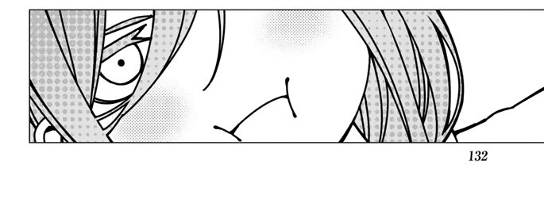

<h1 align="center">ꪖ᥅ᥴꫝ꠸ꪜꫀ ꪖρᒿᔰ</h1>
<p align="center">

</p>
<p align="center">
 
  

<p align="right">
<a href="#">
</p>


## what is ꪖ᥅ᥴꫝ꠸ꪜꫀ ꪖρᒿᔰ

is an image archive website owned by the Ap class of 2024.</br></br>
<a href="https://archiveofap24.vercel.app/"> ꪖ᥅ᥴꫝ꠸ꪜꫀ ꪖρᒿᔰ</a>

 
## clone this website 

[](https://astro.build) 
```bash
git clone --depth 1  https://github.com/st-Ir/photos.git
cd photos
npm update
npm run dev
```

## License

> [!IMPORTANT]
> This repository is highly inspired by [astro-multivers](https://astro-multiverse.vercel.app/) The original project's repository is available at [this link](https://github.com/AREA44/astro-multiverse) and is distributed under the MIT License. Likewise, this repository will also be distributed under the MIT License.
> 
> Please note that this repository is not a fork, but a port from VitePress to Astro.
>


